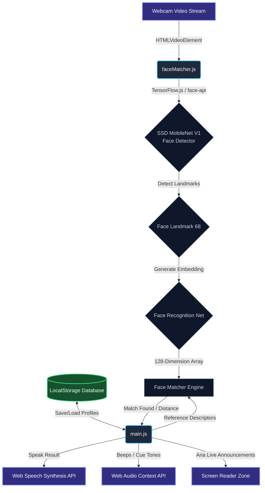

# Hackathon Presentation Guide: Third Eye

Welcome to your hackathon presentation guide for **Third Eye**! This document contains all the technical details, file-by-file language breakdown, architecture diagrams, and "wow-factor" highlights to help you deliver a winning pitch.

---

## 1. Project Overview & The Pitch
* **Name**: Third Eye
* **Tagline**: AI-Powered Real-Time Assistive Vision for the Visually Impaired.
* **Problem**: Visually impaired individuals struggle to know who is in their immediate environment without physical touch or verbal greetings, causing social isolation or disorientation.
* **Solution**: A lightweight, client-side, voice-first web application that uses pre-trained AI neural networks to recognize faces in real-time, announcing who enters or leaves their field of vision using Web Speech Synthesis and audio cue tones.

---

## 2. File & Language Structure
This project is built using a modern, fast, client-side stack (**HTML5, JavaScript, Vanilla CSS, and Node.js** for build tooling).

| File Path | Language / Format | Size (Bytes) | Role & Responsibility |
| :--- | :--- | :--- | :--- |
| [`index.html`](file:///c:/Users/Dell/.gemini/antigravity/scratch/third-eye/index.html) | **HTML5** | ~6.2 KB | Defines the visual viewport, layout structure, accessible ARIA live-announcements zone, settings widgets, and links Javascript assets. |
| [`src/main.js`](file:///c:/Users/Dell/.gemini/antigravity/scratch/third-eye/src/main.js) | **JavaScript (ES6 Modules)** | ~25.6 KB | **Application Controller:** Orchestrates camera streams, voice recognition commands, text-to-speech feedback, keyboard accessibility hooks, detection aggregation logic, and database persistence. |
| [`src/faceMatcher.js`](file:///c:/Users/Dell/.gemini/antigravity/scratch/third-eye/src/faceMatcher.js) | **JavaScript (ES6 Modules)** | ~5.5 KB | **AI Service Layer:** Initializes face-api.js neural networks, handles single-face descriptor extraction (128-dim embedding), computes Euclidean distance for matching, and renders video canvas boxes. |
| [`src/style.css`](file:///c:/Users/Dell/.gemini/antigravity/scratch/third-eye/src/style.css) | **CSS3 (Vanilla CSS)** | ~11.4 KB | **Design System:** Implements dark-mode glassmorphism styling, responsive layouts, focus rings for screen reader users, and animated scanning visual lines. |
| [`download-models.js`](file:///c:/Users/Dell/.gemini/antigravity/scratch/third-eye/download-models.js) | **JavaScript (Node.js)** | ~1.4 KB | **Setup Script:** Automatically copies pre-trained weights/manifests from installed `node_modules` into the `/public/models` static assets directory. |
| [`vite.config.js`](file:///c:/Users/Dell/.gemini/antigravity/scratch/third-eye/vite.config.js) | **JavaScript (Vite Config)** | ~450 B | **Build Server Configuration:** Forces HTTPS via self-signed SSL certificates (required for secure camera APIs) and binds to network interfaces for mobile testing. |
| [`run-engine.bat`](file:///c:/Users/Dell/.gemini/antigravity/scratch/third-eye/run-engine.bat) | **Windows Batch Script** | ~1.3 KB | **Developer Experience (DX):** Bootstraps node dependencies, fetches models, displays local WiFi IP addresses for mobile-to-laptop mirroring, and starts the local server. |
| `package.json` | **JSON** | ~400 B | Defines project metadata, npm build/run scripts, and dependencies (`@vladmandic/face-api`, `vite`, etc.). |

---

## 3. System Architecture & Flow

---

## 4. Crucial Technical Highlights for Judges
When presenting at the hackathon, emphasize these four engineering design patterns that make this project robust:

### 1. Zero-Backend Privacy (Edge Computing)
* All AI model predictions, facial identification, database storage, and speech processing happen **100% locally** in the user's browser via **TensorFlow.js**. 
* **The Wow-Factor**: No face images or biometric data are sent to any remote server, guaranteeing absolute user privacy—a critical aspect when dealing with biometric and accessibility data.

### 2. Intelligent Voice Aggregation (No Audio Spamming)
* Instead of announcing names on every single frame (~10-30 times per second) which would result in annoying, repetitive speech feedback, `main.js` processes frames at 10 FPS and buffers detected labels inside an **Accumulator Buffer**.
* A timer sweeps the buffer every **1.5 seconds**, finds unique faces detected during that window, diffs them against the **Last Announced Set**, and announces only **newly arrived or newly departed people**.
* This results in natural-sounding notifications (e.g., *"John is here"* instead of repeating *"John"* 50 times).

### 3. Accessible-First Hardware Integration (UX)
* **Keyboard Shortcuts**: Built-in shortcut listeners allow visually impaired users to use standard tactile keyboard inputs (`Space` to toggle camera, `R` to register, `S` for status check, `V` for voice command recognition).
* **Responsive Multi-Modal Cues**: Provides custom audio frequencies (Web Audio Context oscillator) using specific pitches to confirm action states (high pitch for scan starting, lower sawtooth tones for deletion or errors).

### 4. Cross-Device Development Server Setup
* Modern browsers block webcam access (`navigator.mediaDevices.getUserMedia`) on unsecure hosts. 
* By incorporating `@vitejs/plugin-basic-ssl` and configuring the dev server host to bind to `0.0.0.0`, the system generates self-signed certificates. The bootstrap script `run-engine.bat` dynamically prints local IPv4 links so judges can load and test the web app directly on their mobile phones over Wi-Fi.

---

## 5. Suggested Presentation Slide Outline (5-Minute Pitch)

1. **Slide 1: Introduction & Title**
   * Project: *Third Eye*
   * Pitch: A helper visual-recognition device built into any smartphone/browser to give visually impaired users a voice-guided understanding of who is near them.
2. **Slide 2: The Social Problem**
   * Highlight how blind individuals feel left out of silent arrivals in rooms. Traditional screen readers only read text, but not physical social spaces.
3. **Slide 3: Demonstration / Live Video**
   * Show a quick screen recording or live demo of pointing the camera, registering a face, and hearing the computer speak their name.
4. **Slide 4: Technical Architecture**
   * Client-side face embeddings (128-dimensional Float32 arrays) saved to `localStorage` and matched using Euclidean distance via MobileNet Neural Networks.
5. **Slide 5: Key Achievements & Tech Stack**
   * 100% Private (no cloud API).
   * Web Speech Synthesis + Web Speech Recognition (voice commands).
   * Designed from scratch to be fully keyboard navigable and screen-reader friendly.
